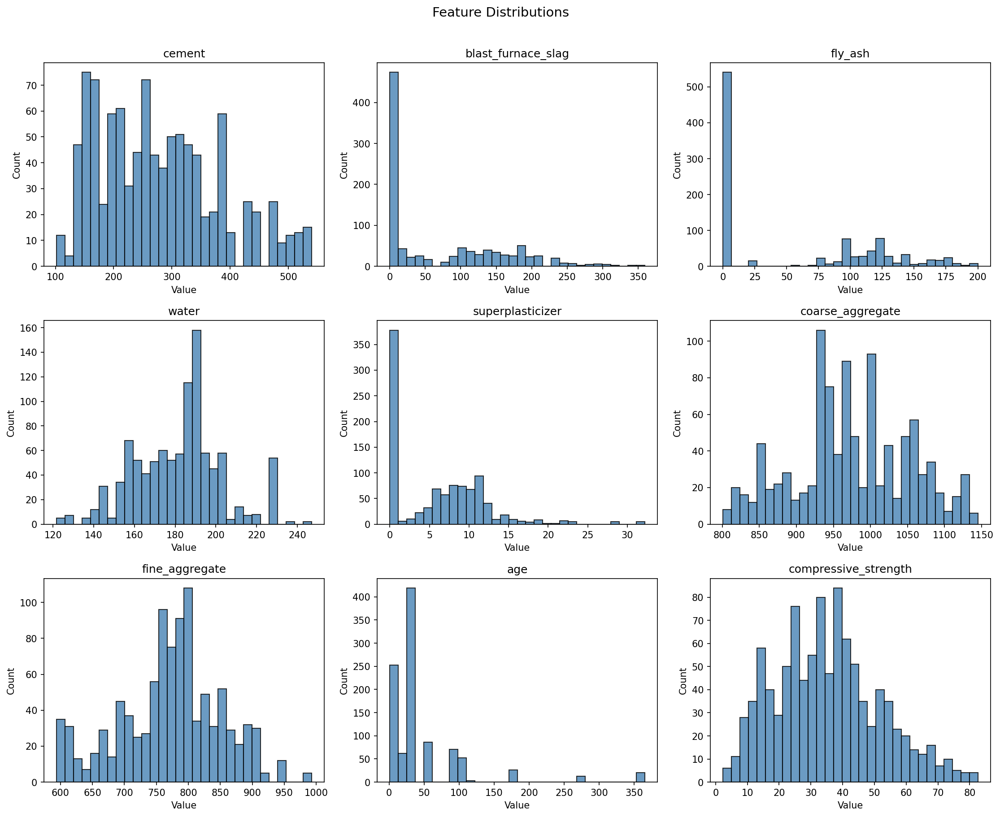
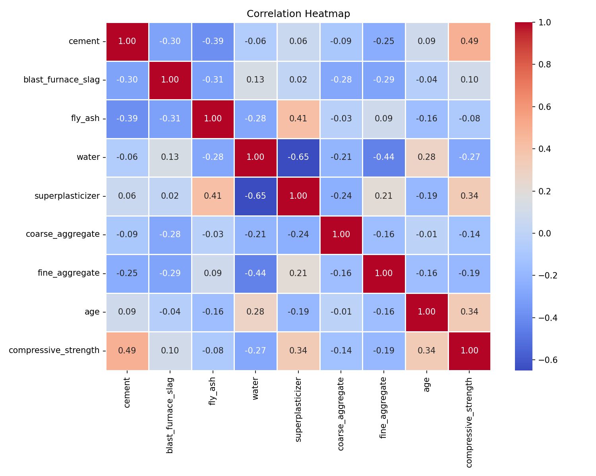
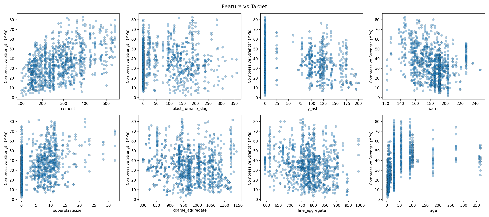
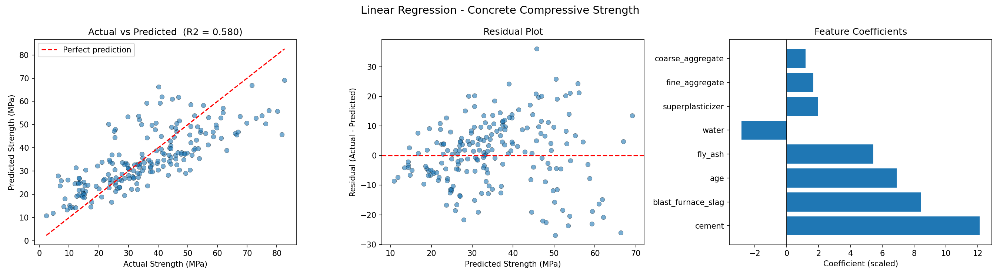
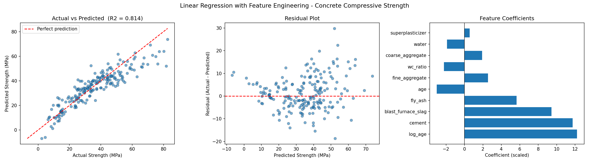
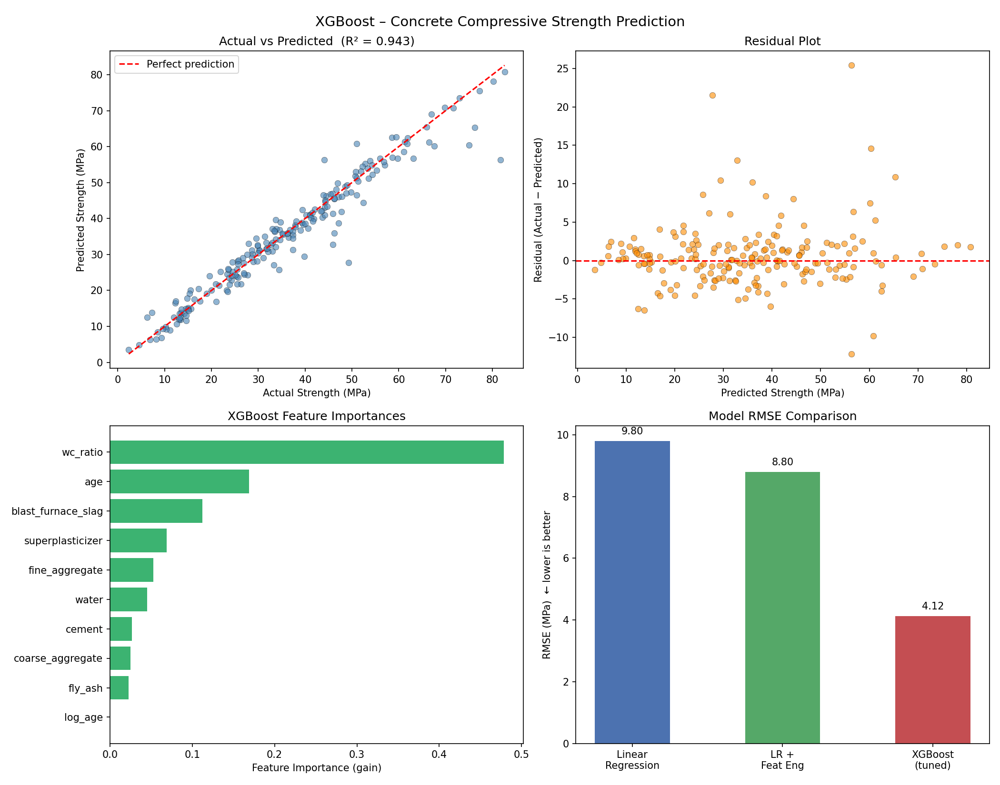
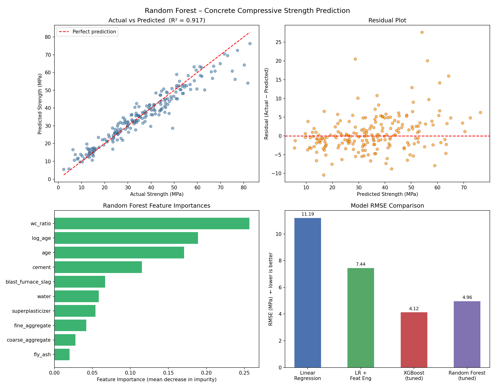

# Concrete Compressive Strength Prediction

A machine learning project predicting concrete compressive strength (MPa) from mix ingredients. Models explored: Linear Regression, Linear Regression with Feature Engineering, XGBoost, and Random Forest.

Part of my personal ML learning journey — working through real datasets, building proper pipelines, and understanding what actually moves the needle.

---

## Dataset

**Source**: UCI Machine Learning Repository — donated by Prof. I-Cheng Yeh (Chung-Hua University, Taiwan).

1030 samples, 8 input features, 1 target. The readme claimed no missing values — EDA found **25 duplicate rows**, which get dropped before training (clean set: 1005 rows).

| Feature | Unit |
|---|---|
| Cement | kg/m³ |
| Blast Furnace Slag | kg/m³ |
| Fly Ash | kg/m³ |
| Water | kg/m³ |
| Superplasticizer | kg/m³ |
| Coarse Aggregate | kg/m³ |
| Fine Aggregate | kg/m³ |
| Age | days |
| **Compressive Strength** *(target)* | MPa |

### EDA Plots







---

## Scripts

### `eda.py`
Runs before anything else. Checks missing values, duplicate rows, plots feature distributions, correlation heatmap, and feature-vs-target scatter plots. Saves everything to `plots/`.

### `linear_regression.py`
Baseline model — no feature engineering. Just the raw 8 features scaled and fed into `LinearRegression`.

**Pipeline**: EDA checks → 80/20 split → StandardScaler → LinearRegression → evaluate

| Metric | Value |
|---|---|
| MAE | 8.896 MPa |
| RMSE | 11.192 MPa |
| R² | 0.5801 |



### `linear_regression_feat_eng.py`
Same pipeline but with two extra features derived from the raw data:

- **`wc_ratio`** = water / cement — a known physical indicator of strength in concrete science. Lower ratio means stronger mix.
- **`log_age`** = log(1 + age) — age has diminishing returns on strength (gains fast early, plateaus later). The log transform captures that curve inside a linear model.

| Metric | Baseline | Feature Eng. | Change |
|---|---|---|---|
| MAE | 8.896 MPa | **5.749 MPa** | -2.15 |
| RMSE | 11.192 MPa | **7.442 MPa** | -3.75 |
| R² | 0.5801 | **0.8143** | +0.234 |



`log_age` and `cement` came out as the top two predictors. `wc_ratio` has a negative coefficient — higher water-to-cement ratio means weaker concrete, which matches the physics exactly.

### `xgboost_model.py`
XGBoost regressor with feature engineering and hyperparameter tuning via `GridSearchCV` (5-fold CV, 108 candidate combinations).

**Pipeline**: deduplication → `wc_ratio` + `log_age` features → 80/20 split → XGBRegressor → GridSearchCV → evaluate

**Best hyperparameters**

| Parameter | Value |
|---|---|
| `n_estimators` | 400 |
| `max_depth` | 5 |
| `learning_rate` | 0.1 |
| `subsample` | 0.8 |
| `colsample_bytree` | 1.0 |

**Evaluation**

| Metric | Value |
|---|---|
| MAE | **2.539 MPa** |
| RMSE | **4.124 MPa** |
| R² | **0.9430** |
| CV RMSE (5-fold) | 4.321 MPa |

**Feature importances (gain)**

| Feature | Importance |
|---|---|
| `wc_ratio` | 47.8% |
| `age` | 16.9% |
| `blast_furnace_slag` | 11.2% |
| `superplasticizer` | 6.9% |
| `fine_aggregate` | 5.3% |
| others | ~8% |

`wc_ratio` is the single most important predictor — consistent with concrete physics (lower water-to-cement ratio = stronger mix).



### `random_forest.py`
Random Forest with the same feature engineering as XGBoost, tuned via `GridSearchCV` (5-fold CV, 24 combinations).

**Pipeline**: deduplication → `wc_ratio` + `log_age` features → 80/20 split → RandomForestRegressor → GridSearchCV → evaluate

**Best hyperparameters**

| Parameter | Value |
|---|---|
| `n_estimators` | 400 |
| `max_depth` | None (full trees) |
| `max_features` | 0.5 |
| `min_samples_leaf` | 1 |

**Evaluation**

| Metric | Value |
|---|---|
| MAE | 3.401 MPa |
| RMSE | 4.965 MPa |
| R² | 0.9174 |
| CV RMSE (5-fold) | 5.130 MPa |

**Feature importances (mean decrease in impurity)**

| Feature | Importance |
|---|---|
| `wc_ratio` | 25.7% |
| `log_age` | 18.9% |
| `age` | 17.1% |
| `cement` | 11.5% |
| `blast_furnace_slag` | 6.7% |
| others | ~20% |

Random Forest spreads importance more evenly than XGBoost — both `age` and `log_age` rank, whereas XGBoost gave `log_age` zero weight and loaded `wc_ratio` at 48%. The ensemble still beats linear regression by a wide margin (RMSE 4.965 vs 11.192), but XGBoost's gradient boosting squeezes out another ~0.85 MPa improvement.



---


## Overall Model Comparison

| Model | MAE (MPa) | RMSE (MPa) | R² |
|---|---|---|---|
| Linear Regression | 8.896 | 11.192 | 0.5801 |
| LR + Feature Engineering | 5.749 | 7.442 | 0.8143 |
| Random Forest (tuned) | 3.401 | 4.965 | 0.9174 |
| **XGBoost (tuned)** | **2.539** | **4.124** | **0.9430** |

Both tree ensembles clear R² > 0.91. XGBoost edges Random Forest by 0.84 MPa in RMSE — gradient boosting's sequential error-correction wins here over bagging. Linear regression lands at R² 0.58; feature engineering alone pushed that to 0.81, which shows how much domain knowledge (`wc_ratio`, `log_age`) is worth before touching model complexity.

---


## Setup

```bash
pip install numpy pandas scikit-learn matplotlib seaborn openpyxl xgboost
```

Run in order:
```bash
python eda.py
python linear_regression.py
python linear_regression_feat_eng.py
python xgboost_model.py
python random_forest.py
```

Plots from EDA and model runs save to `plots/`. README assets are in `assets/`.

