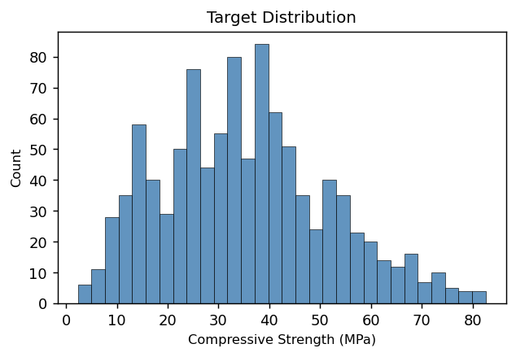
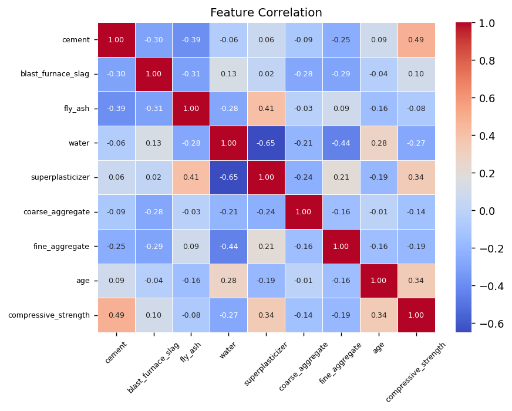
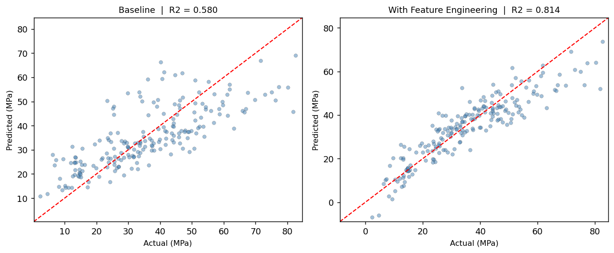
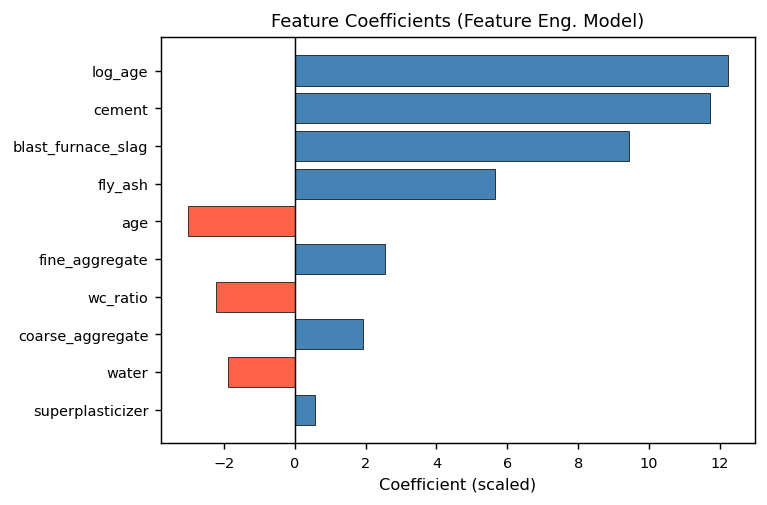

# Concrete Compressive Strength Prediction

A machine learning project where I try to predict concrete compressive strength (MPa) from its mix ingredients using linear regression.

Part of my personal ML learning journey — working through real datasets, building proper pipelines, and understanding what actually moves the needle.

---

## Dataset

**Source**: UCI Machine Learning Repository — donated by Prof. I-Cheng Yeh (Chung-Hua University, Taiwan).

1030 samples, 8 input features, 1 target. The readme claimed no missing values — EDA found **25 duplicate rows**, which get dropped before training (clean set: 1005 rows).

| Feature | Unit |
|---|---|
| Cement | kg/m³ |
| Blast Furnace Slag | kg/m³ |
| Fly Ash | kg/m³ |
| Water | kg/m³ |
| Superplasticizer | kg/m³ |
| Coarse Aggregate | kg/m³ |
| Fine Aggregate | kg/m³ |
| Age | days |
| **Compressive Strength** *(target)* | MPa |

### Target Distribution



### Feature Correlation



---

## Scripts

### `eda.py`
Runs before anything else. Checks missing values, duplicate rows, plots feature distributions, correlation heatmap, and feature-vs-target scatter plots. Saves everything to `plots/`.

### `linear_regression.py`
Baseline model — no feature engineering. Just the raw 8 features scaled and fed into `LinearRegression`.

**Pipeline**: EDA checks → 80/20 split → StandardScaler → LinearRegression → evaluate

| Metric | Value |
|---|---|
| MAE | 8.896 MPa |
| RMSE | 11.192 MPa |
| R² | 0.5801 |

### `linear_regression_feat_eng.py`
Same pipeline but with two extra features derived from the raw data:

- **`wc_ratio`** = water / cement — a known physical indicator of strength in concrete science. Lower ratio means stronger mix.
- **`log_age`** = log(1 + age) — age has diminishing returns on strength (gains fast early, plateaus later). The log transform captures that curve inside a linear model.

| Metric | Baseline | Feature Eng. | Change |
|---|---|---|---|
| MAE | 8.896 MPa | **5.749 MPa** | -2.15 |
| RMSE | 11.192 MPa | **7.442 MPa** | -3.75 |
| R² | 0.5801 | **0.8143** | +0.234 |

### Actual vs Predicted



### Feature Coefficients



`log_age` and `cement` came out as the top two predictors. `wc_ratio` has a negative coefficient — higher water-to-cement ratio means weaker concrete, which matches the physics exactly.

---

## Setup

```bash
pip install numpy pandas scikit-learn matplotlib seaborn openpyxl
```

Run in order:
```bash
python eda.py
python linear_regression.py
python linear_regression_feat_eng.py
```

Plots from EDA and model runs save to `plots/`. README assets are in `assets/`.

---

## What is next

- Polynomial features
- Random Forest and Gradient Boosting — this dataset is highly nonlinear
- Cross-validation instead of a single train-test split
- Side-by-side model comparison table